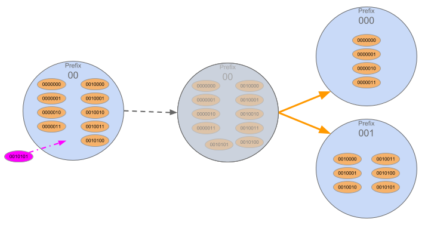
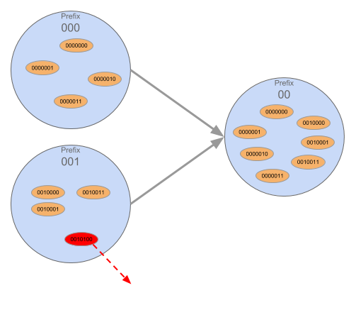

# Sharding / Disjoint Sections

## Summary
Strategy used to scale a Network by distributing the load between "shards" where each "shard" is only responsible for part of the Network's functioning.
In the SAFE Network, Disjoint Sections act as shards which is process by which sections change size, the location of responsibility and often their Neighbours due to splits and merges.
### Splits
Triggered by a new node joining
Split is the process by which a section makes a binary split into two smaller sections.
Splits only occur once certain factors have been met:
There must be a minimum group size for each child
Plus a buffer
Splits are a valid loss of information, neighbours and responsibility for a node

### Merges
If the nodes in a Section fall below the ‘MinimumGroupSize’, the nodes of one Section will merge with their sibling.
Merges lead to an increase in area of responsibility.

## Status
Present in Alpha 2 / unique to Safe

## How it works
Before we get into Sections, we’ll just briefly touch upon bootstrapping
When a node first joins, it contacts a proxy
That proxy sends the node to a Section which asks the newcomer to generate a new public/private keypair within a specified range that is covered by that Section.
This is different to Bitcoin for SAFE, the ID generation is random, but still defined to a given range. BTC generated at random not within range.  
The new node now has a Public Signing Key which doubles as its XOR address on the Network  

### Sections
A subset of all the addresses on the Network. The Network is a 32 byte or 256 bit range of addresses.

256 bit = 2 to the power of 256 possible combinations (78 digits)

**The Network Invariant specified for Disjoint sections:**
- Each prefix is responsible for part of the network, a node cannot be in more than 1 Section (unlike a Group)
- No overlap because the Section is defined by the node’s prefix
- So a node that has a prefix 11001… will be in that Section - it cannot be in e.g. Section 10101

### Neighbours:
Are Sections that have a prefix which differs from their own prefix by one single bit.  

In the example of:
00, 01, 10, 11 (which covers the whole network space)
00’s neighbours are 01 and 10 only.
11 does not count as a Neighbour (as the prefix differs by 2 bits).

Once you identify a Section as your neighbour, they also identify you as their Neighbour.

### Siblings:
Are a special subset of Neighbours. Siblings have prefixes that differ by only 1 bit at the very last bit. In the example above, 01 would be the sibling to 00. Siblings are crucial for merges. If no Sibling exists when a merge is required, the Sections would have to collapse/merge until a Sibling is created (i.e. the tree collapses upwards until it ends up with a Section whose prefix differs by only the last bit).  

### Splitting:
Splits involve a binary split of one disjoint section into two sibling disjoint sections.  
Involves a valid loss of information from a node as it becomes part of a different section which are responsible for a smaller XOR space
Don't require an external source of trust as they got enough information from the section they used to be a member of. (As opposed to merges where you need to gain info from your sibling and establish trust in the process)
Removing a node will never trigger a disjoint section to split

### Split mechanism:
- A split may occur when a node joins the section. In order for a split to occur there must be a minimum number (8 - current group size) of peers and a buffer for each child.  
- The buffer is required to reduce the likelihood of a re-merge as these are expensive/resource intensive network activities. As there is continual node loss and churn.
- The buffer is required to minimise merge events being triggered as a result of a node or two disconnecting. We do not want too many merges as they are resource heavy. All prefix changes are Network expensive.
- Splits do not need to happen immediately as unlike mergers there is no risk of data loss, so these can be a key area for Network throttle.
- An unbalanced section can split into more than one child on one side. This is known as a multi-split. I.e. 01 would split into 010 and 111. This would occur if there was a very large number of nodes with the prefix 11 and as soon as the split into 10 and 11 occurs there is already enough to split into 110 and 111.  
- A split represents a valid loss of information. Nodes from a splitting section will be responsible for less information following a split, as they are now responsible for a smaller section of the Network.     
This will not be not in Fleming but will be included in Maxwell as there is no data in Fleming
This has benefits to scalability and performance, as the Network grows sections are responsible for less rather than other models in which the greater the information the slower
- Splits lead to the loss of neighbours

### Merging:
Are far more complicated than splits as sections gain information. The merging sections must be able to trust the previously responsible section for all the information.  

- Two disjoint sections are merged when one of the siblings membership falls below the minimum group size. A Merge will result in a gain of information

- *Removing* a node *may trigger* the merge of two disjoint sections

- Merges are computationally expensive for the Network - as they require nodes to gain new information (which they need to validate in order to trust it) and responsibilities.

- It also means that the Nodes’ prefix will change when they form a new Section  

- Note: post-Fleming, when we have data, the load on the Network will increase, which can impact performance

- A merge must happen immediately to ensure that data is not inaccessible

## Features
### Bootstrapping
When a new node joins the Network, it will contact a proxy node. That proxy directs the node to a Section. That Section will then require the new node to generate a Public Signing Key(pair) that is within a specified range (i.e. the range that Section covers). Once it has done this, its functionality will then be tested (via Resource Proof - i.e. does it have the necessary bandwidth etc).
### Balanced Relocation
When a new node requests to join a section, the section will look at the identities of the existing members and in order to ensure balance in the event of a split.
### Splits
A split occurs in a section when the section gets too big and unbalanced.  
### Merge
Merges happen when there are too few nodes (below minimum group size) in a Section so the nodes ‘merge’ with another Section.  You can only merge with a sibling.  

## Benefits
Scalability
