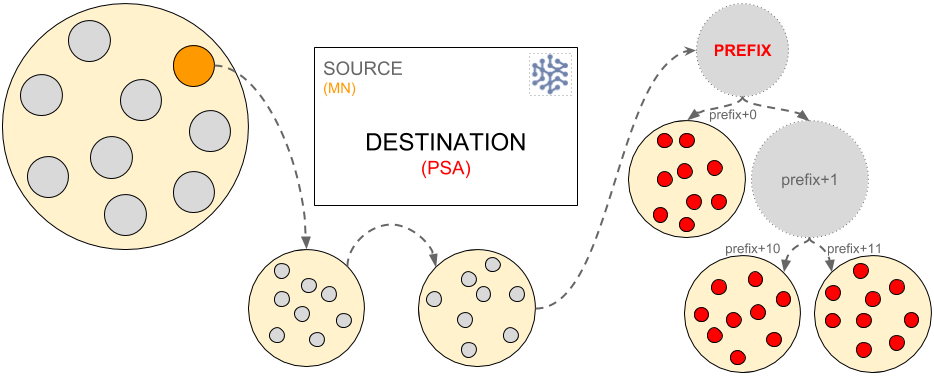

# Authorities

## Summary
- The relaying of messages across the network is determined by authorities.
- Messages can be sent from, or to, a single node or a collection of nodes.
- Each message must have sender & destination details. _For all authorities other than PrefixSection this is a full XOR address (and Client Public ID for Client authority), for PrefixSection it is a prefix_.

Authorities can be thought of as address labels on an envelope which detail the destination and sender address.

## Status
Existing feature of the SAFE Network

## Types of authorities
Authorities can be either singular authorities (single) or group authorities (multiple nodes). This means that the message is either verified by a single node or a group of nodes.

### Singular authorities
No verification is required from other sources in order to relay the message.
- #### ManagedNode
Can be the source or final destination of the message and it’s address is the given node address.
- #### Client
Can be the source or final destination of the message. A client authority is a client connecting to the network via a proxy node. The message must specify the proxy node address and the public ID of the client.

### Multiple (Group) authorities:
In order to relay the message it must be verified by a quorum of nodes in either the section or group.

- #### Section:
    * **Section**: If the destination authority is Section then all nodes within the section receive the message. If the source is Section then a quorum from the section nodes must verify the message in order to relay it.
    * **PrefixSection**: If the address is defined as a prefix (rather than an XOR location), the message is received by all sections (and thus nodes) within that prefix range (the ‘root’ level prefix and all child sections of that prefix).
- #### Group: ClientManager, NodeManager, NaeManager
Require quorum agreement from the group of nodes closest to the source.

#### Examples
The following are some examples of message relay from and to different authorities.
##### Section Authority (SA) to a Managed Node (MN)

The node within the section address closest to the hash of the destination, acts as the accumulation node (indicated in orange below)  and, if it gets verification from a quorum of the section nodes, sends the message to the destination (indicated in red below) via section relay…

##### ManagedNode to PrefixSection
A single ManagedNode (MN) sends a message to a PrefixSection (PSA).

The ManagedNode (indicated in orange below) sends the message to the destination prefix (as a Single Authority it does not require quorum agreement prior to sending).  Once the prefix section receives the message it delivers the message to all nodes within the prefix.

## Features
- Group authorities
- Singular authorities

## Benefits
- Range of authorities enable the Network to transport communication effectively and honestly
- The categorisation of single versus group nodes and this determines how the message is relayed
