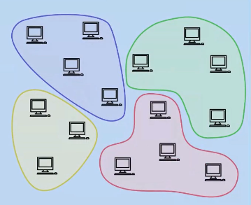

# Groups & Sections

## Summary

### Groups:
Dictate which nodes control which data.

Made up of 8 nodes based on closeness of [XOR](/01_glossary/#xor) address and because of that can overlap.

### Sections:
Govern how nodes send messages across the Network

Made up of an undefined number of nodes and ordered on prefix addresses. Sections can merge and split to ensure efficient operation on the network.  

## Status
Existing feature of the Network

## What is a section?

A section is a subset of all the addresses on the Network’s 256 bit address space. Therefore a Section is responsible for a specific part of the Network as defined by an XOR location. Minimum nodes for a Section defined by ‘MinimumSectionSize’, currently this is likely to be 8 (5 sufficient for consensus and 3 for buffer)

All nodes in a section will have the same prefix which also relates to the section of the network they are responsible for.  Sections do not overlap and nodes can only be part of one section.  This means each section is only aware of, and connected to, themselves and their neighbours.

The Chain is a record of information, that can be utilised by anyone.  The Chain is a single chronological list of actions that have occurred in each of the Sections. We can see our chain and parts of other (neighbours) sections chains.  

Neighbours to a section are determined by the network invariant.  To be a Neighbour, it must have a prefix which differs by only a single bit from another node.

## What is a Group

A Group is a group size number of nodes (8) and this is defined by their closeness to a XOR address.  Unlike Sections, these can overlap and nodes can be members of a number of different Groups.

The closer a node is to an address space, the more info it has about the address (similar to the knowledge of the [country, city, postcode, house address])

Security increases as Network grows and this is because each node becomes responsible for a tighter group of addresses.  

|  |  |
| :--: | :--: |
| Sections | Groups |

## How it works

A new node joins the Network (via Bootstrap process)
Contacts a (dumb) proxy
Proxy sends new node to a Section
New node has to then generate keypair that falls within range of Section addresses
So if sent to Section 11010…, node’s address must also start with 11010...
Unlike Bitcoin where any random address is created
The public signing key it has created now acts as that node’s new location on the Network
New Section now checks new node is suitable (Resource Proof)
