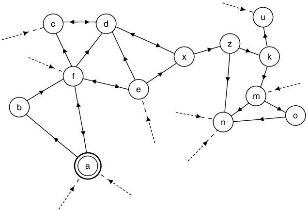

# Chain

##Summary
The chain is a record of action, decisions and activity of sections and their neighbours. It stores Section Info, Proofs, and Neighbour Info for the purposes of relaying it to other sections.

The chain is not linear but instead should be visualised as a **chain of trust**.

## Status
New

## How it works
The chain is a record of action, decisions and activity of sections in order to give clarity to others who do not see the gossip graph, membership list or events. In the case of PARSEC interesting blocks and consensus blocks are recorded on the chain.

The chain exists to relay section info which has been verified (by a quorum of signatures) to other sections.  

The chain is not linear but instead should be visualised as a **chain of trust**. Each section has a linear sequence but they also see their neighbour's linear sequence thus creating the web.



Chains are written to the memory of the node and reside there for the lifetime of the session.

Things that are kept on the chain

- Proofs (signatures of quorum members of the section)
- Neighbour info
- Section info is an object that contains info of the section that is signed by a quorum of members, section info includes:
    - Section Prefix - the first numbers at the beginning on the XOR address that define the nodes section
    - Version - a number which increases incrementally as members change
    - Members - public identity (public key and encryption key)
    - Previous hash - previous section info
    - Hash (all of the above)

**Previous hash** is a list, comparable to a blockchain that points to previous section info, for example. there will be 2 hashes of 2 previous section info when a merge has been completed.

**Membership:** Always changes by one except in the case of merges when all nodes from the merging section are added at once.

**Versions:** The members of a section at a given point in time. Members can only change (add/leave) one at a time, and the version increases by one with each change.  Changes are singular. Except in the case of merges where there may be a version shift in one child.  The child with the smaller version will experience a version shift (by more than one), while the version number of the other child increase incrementally by one. Each version will be signed by a quorum of members to be considered valid by another section.

A version shift change can be seen as a bug.  Unless accompanied by the following as these would highlight a merge.
- A prefix change
- A membership list change shift

In the case of a split, children will hold the previous section info from the parent in the previous hash.

The chain captures **OurInfo** as well as **NeighbourInfo**. The advantage of recording this sequence is that a peer cannot lie and/or alter the sequence or entries as the hashes are sequential and incremental.

**OurInfo:** maintained by self and holds every piece of historic section info
**NeighbourInfo:** maintain info about neighbours, however, only the latest state is maintained. This is replaced after each churn event.  In order to update neighbour info the section must receive signatures from a quorum of known members.

The chain would also hold signatures to verify each section info from a quorum of section members.

## Worked example
The following example incorporates these concepts:

```
**Network Genesis - Min section size 3, Buffer 0**


Si: {Members: (0,1), Prefix: ( ), Version (0), PreviousHash ( )}

Si: {Members: (0,1,2), Prefix: ( ), Version (1), PreviousHash (Si 0)}, proofs Si 0

Si: {Members: (0,1,2,3), Prefix: ( ), Version (2), PreviousHash (Si 1)}, proofs Si 1

Si: {Members: (0,1,2,3,4), Prefix: ( ), Version (3), PreviousHash (Si 2)}, Proofs Si 2

New node(5) joins triggering a split

Section splits

Si: {Members: (0,1,2,3)            Si:{Members: (4,5,6)
Prefix: (0)                        Prefix: (1)
Version (4)                        Version (4)
PreviousHash (Si 3)}               PreviousHash (Si 3)}
Proofs Si 3                        Proofs Si 3                         

No change                          +1 (node 8 joins)


Si: {Members: (0,1,2,3)            Si: {Members:(4,5,6,8)
Prefix: (0)                        Prefix: (1)
Version (4)                        Version (5)
PreviousHash (Si 3)}               PreviousHash (Si 4)}   
Proofs Si 3                        Proofs Si 4

- 1 (node 2 leaves)                - 1 (node 6 leaves)


Si: {Members: (0,1,3)              Si:{Members: (4,5,8)
Prefix: (0)                        Prefix: (1)
Version (5)                        Version (6)
PreviousHash (Si 4)}               PreviousHash (Si 5)}  
Proofs Si 4                        Proofs Si 5    

No change                          - 1 (node 5 leaves)


Si: {Members: (0,1,3)              Si: {Members: (4,8)
Prefix: (0)                        Prefix: (1)
Version (5)                        Version (7)
PreviousHash (Si 4)}               PreviousHash (Si 6)}    
Proofs Si 4                        Proofs Si 6

Section (Prefix 1) falls below min section size - merge triggered


Si: {Members: (0,1,3,4,8)
Prefix:( )
Version (8)
PreviousHash (Si 5, Si 7)
Proofs Si 5, Si 7

```

## Features
- Linear and non-linear chain (chain of trust)
- Hash entries are only sequential and incremental

## Benefits
- Enables a record of action, decisions and activity of sections to be passed between neighbouring sections.
