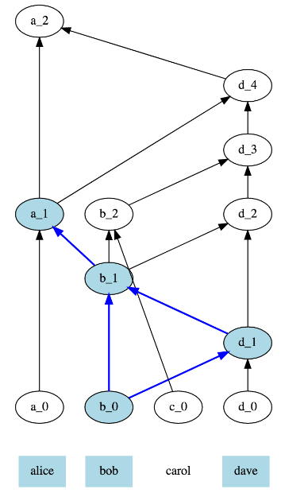

# PARSEC

Reputation system with incentivise good behaviour to protect the Network from malicious nodes.
Temp - [Glossary of Terms (from RFC)](https://docs.google.com/document/d/1OSX6a5s_RQEVu3io3CAsSUmSS8Ey_YE-CjJKFIJKIcA/edit)

## Status
In Fleming, PARSEC v2 whitepaper released

## Background information

### Why do we need consensus in an asynchronous network?

The SAFE Network is Asynchronous.  Asynchronous is the opposite of synchronous, which means happening at the same time. Think of “synchronous” as “in synch” and asynchronous as “out of synch.”

In Synchronous consensus, all communication proceeds in rounds. This can be because synchronous consensus is easier to model than real life, which is inherently asynchronous in order etc.  For example, a  phone call is  pretty synchronous because person 1 calls, waits for someone to pick up, then speaks, then waist for person 2 to answer, then speaks again. If the person 2 is silent for a minute or so after person 1 stopped speaking, they will assume there is a problem and hang up (abort the protocol).

An example of asynchrony would be Slack where many conversations are happening and a delay in a marketing conversation will have no influence on a conversation within a given channel.

An asynchronous protocol is one in which no matter how bad the delays in communications between parties, as long as every message is eventually delivered, the protocol eventually terminates (or in other words, doesn’t stall indefinitely)

So what does that have to do with consensus?  Such mechanisms are essential in dencrealisted networks, as there is no central authority to provide truth.  Essentially, a consensus method is employed to allow all actors in the network to come to agreement on what the true information is. This is done by the majority of the network agreeing (Quorum) on the information presented.

Additionally,  consensus allows structure of the Network to be maintained, by allowing each node to know exactly how to cooperate with other nodes at any time because we know that we will all agree on the meaning of our exchanges.

#### What's in our consensus algorithm:
1. **Asynchronous** - because our Network is run by computers, latency is unpredictable.  This means that without asynchrony, a malicious node could control the Network for the time it takes a message to be transmitted.
2. **Able to work in a Permissionless Setting** - because 1) Anyone can run a Vault and try to mess with our protocol, and 2) Nodes can go offline and rejoin when they want, so we need dynamic membership to handle that.
3. Proven with **probability one** instead of relying on high statistical probability of consensus.
4. Has the Fault Tolerance Level where **less than one third** of the voting members in a section are faulty or dishonest.
5. **Scalable** - Our Network wants to store all the data in the world on all the computers in the world, so it has to be theoretically scalable.  
6. **Open Source** - because we want entire access for everyone - where everyone can review the code, contribute if they want to, and know that we are not doing anything malicious.
7. **Simple** - This will increase security, because it means that anyone in the space can review it.  If it is complicated it could take 10 years until someone notices a flaw.

### Byzantine Fault Tolerance

#### Overview
A Byzantine fault is a fault presenting different symptoms to different observers. A network is Byzantine Fault Tolerant (BFT) when it can provide service and reach a consensus in spite of system faults or failures. Consensus algorithms are what makes it possible for distributed networks to solve the Byzantine Generals Problem, even when there are unreliable or malicious actors operating.
#### Background
The Byzantine Generals Problem is a thought experiment by Leslie Lamport in which a group of army generals formulate a plan for attacking a city. It was devised to make the problem and impact of malicious nodes operating within a network easier to understand.
In its simplest form, the generals must decide whether to attack or retreat. Some generals may prefer to attack, while others prefer to retreat. The important thing is that every general agrees on a common decision, for a halfhearted attack by a few generals would become a rout, and would be worse than either a coordinated attack or a coordinated retreat.
The problem is complicated by the presence of treacherous generals who may not only cast a vote for a suboptimal strategy, they may do so selectively. For instance, if nine generals are voting, four of whom support attacking while four others are in favor of retreat, the ninth general may send a vote of retreat to those generals in favor of retreat, and a vote of attack to the rest. Those who received a retreat vote from the ninth general will retreat, while the rest will attack (which may not go well for the attackers). The problem is complicated further by the generals being physically separated and having to send their votes via messengers who may fail to deliver votes or may forge false votes.
The objective of Byzantine fault tolerance is to be able to defend against failures of system components with or without symptoms such as malicious or faulty nodes that can prevent other components of the system from reaching an agreement among themselves, where such an agreement is needed for the correct operation of the system.
BFT consensus is the ability to tolerate "byzantine failures" = malicious behaviour.

## How it works

There are a few components we need to explain first

#### Network events:
A network event can be a node joining the section, or a node leaving, or pretty much anything that happens in the network and requires consensus

#### What is gossip?:
Gossip is a way for a network of computers to exchange information very efficiently with resilience, emulating the way rumours spread in human societies. Each node picks another node at random and shares info with them.

#### What is a DAG?
A Directed Acyclic Graph is a directed graph that has a topological ordering, a sequence of the vertices such that every edge is directed from earlier to later in the sequence.

#### What is a gossip graph?
A gossip graph is a record of gossip communications between nodes that consists of gossip events.  Each gossip graph will ultimately be comprised of the same events after a period of time (eventual consistency).  A gossip graph is a DAG.  

#### What is a gossip event?
A vertex in the PARSEC gossip graph (which is a DAG), which can be viewed as an entry in the record of gossip communications between nodes (the graph is the record). The actual piece of information that nodes want to share using gossip is only a part of the gossip event, which we call “content” or “payload”.

#### What is an event’s ancestor?
An example of an event’s ancestor would be an event’s parent - if two events are connected with an arrow, the event at the base of the arrow is called a parent of the event at the tip.  Then, by extension, an ancestor is also a parent of a parent, or a parent of a parent of a parent, and so on.

#### What is seeing?
A Gossip Event is seen by a later one if there is a directed path going from the latter to the former in the gossip graph.  In the below example, there is a directed line from b_0 to d_4 (blue line) therefore b_0 is ‘seen’ by d_4.

#### What is an interesting event?
An interesting event is a gossip event that has some number of ancestors which contain the same payload - for example, a vote on a node joining. This “some number” depends on something we call “consensus mode”, for now it can be either a supermajority, or just one.

#### What is strongly seen?
This is where an event can be seen by events created by a supermajority of nodes, all of which can be seen by another event.  
In this example, b_0 is seen by ca_1, b_1 and d_1 (created by 3 out of 4 nodes), all of which are seen by a_1.
With a_0 and d_4, the only events seen by d_4 that see a_0 are d_4, a_1 and a_0, which are created by 2/4 nodes, which is not a supermajority (even though these are 3 events).

#### What's an Observer?

Observers describe peers which strongly see interesting gossip events which have been seen by a supermajority of peers.

Observers are relevant as without observers, events would not be strongly seen, and therefore meta votes would not therefore be cast.

Any event that takes place will eventually be seen by an observer.

### So how does this all work?
Using the Gossip Protocol, nodes gossip by selecting another node at random to transmit event history to.  The receiving node adds any new information it has not yet seen to its own history  When a node receives a request, it creates a new event and sends a response back. This creates a verifiable datalog called a gossip graph. Each gossip graph contains what we call a gossip event.  Every gossip event gets added to each nodes gossip graph. Nodes ‘virtually’ vote on observations seen. Each node analyses the gossip graph and if they believe that it has a record of an event which should go next in the chain then it casts a vote as such
A node then counts votes for an event and decides which event should be the next one in order  Once a set number of nodes (a supermajority) have voted for an event then the block is considered valid and ready to enter the consensus protocol to reach consensus.  

To get to consensus, a meta vote is cast. A node answers the question “Does my oldest observer (observer having been defined above) strongly see an interesting gossip event created by the node I am looking at”. The binary value is true or false.
Once a true vote is cast, it means that all honest nodes will also eventually be guaranteed to strongly see the gossip event.
The meta voting is best explained through an illustration.
The bottom quadrants are estimates and the top are bin_values.  So the example below (in red),  if we look at a_1, there is a true and false vote in the estimates quadrants.  This is because a_1 sees c_0 and b_0 which is a third of nodes.  The true value has been added because a_1s self-parent is a_0 and has true in the bottom left quadrant.  
In the same event, false has been added to bin_values as a_1 sees a_1, c_0 and b_0 and they are all false ( a supermajority - 2/3s).  

Where the common coin comes in is if there is a tie break in the bin_values.  In the example below, a_2 has a true and false value in bin_values. This is when the Common Coin comes in.
To achieve Binary (true / false) Byzantine Consensus, a common coin is used.  It is essentially used as a tiebreaker, to solve a split where all honest nodes are tied between true and false in the event that a malicious actor is intentionally keeping a tie such that no decision can ever be reached.
The coin is used to prevent an attacker from working against honest nodes by manipulating the true/false flips. It introduces an unpredictability that a bad actor cannot predict and so avoids the scenario where they keep the protocol tied and unable to make a decision.

## Features
- Common Coin
- Asynchronous
- Open source
- Gossip graph

## Benefits
- Unique to SAFE
- Malice prevention
